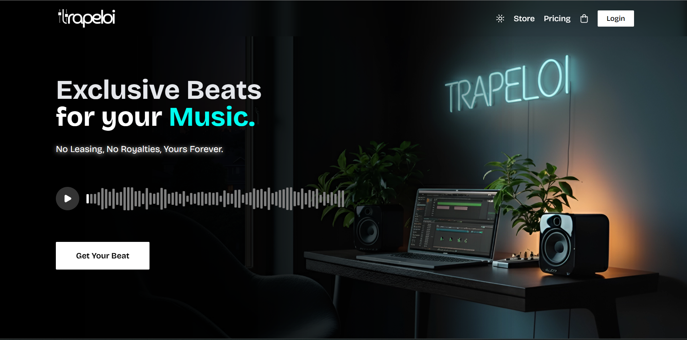
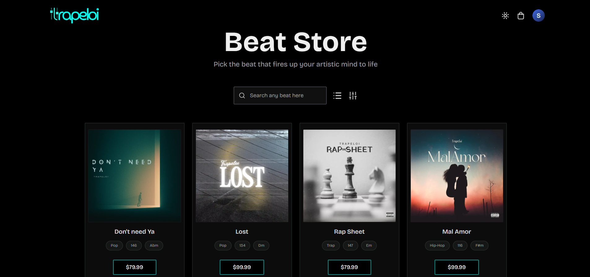
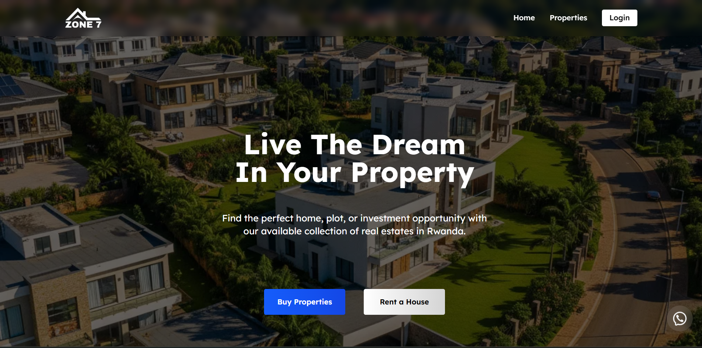
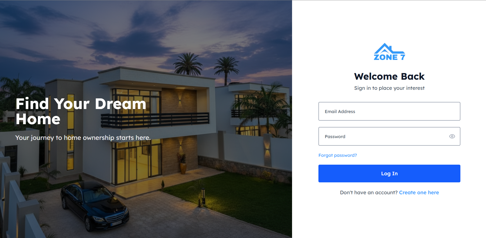
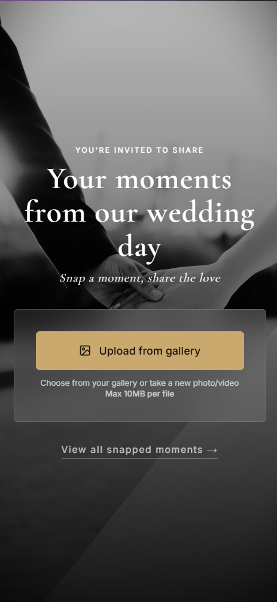

Email: [build@eloishema.dev](mailto:build@eloishema.dev)

## LIVE PROJECTS

### [Trapeloi](https://trapeloi.com) - Beat Store

A music licensing platform I designed, built and maintain solo. A producer upload beats; buyers purchase a lifetime license and download them. No subscriptions, no leases, one payment, full ownership.

<table>
  <tr>
    <td></td>
    <td></td>
  </tr>
</table>

**What's under the hood:**
- Auth via `better-auth` sessions, email verification, OAuth flows
- Bot & abuse protection via `Arcjet`.
- Beat files served from `Cloudflare R2` via signed URLs with access control
- Payments and licensing through `LemonSqueezy`
- Error monitoring via `Sentry` with custom alerting for any server side error
- Transactional email via `Brevo`.

---

### [Zone7](https://zone7.rw) - Real Estate Platform

Delivered as a paid freelance contract. A full property browsing and management platform, listings with search and filtering, plus an admin dashboard for managing properties, users, and inquiries.

<table>
  <tr>
    <td></td>
    <td></td>
  </tr>
</table>

**Architecture highlights:**
- Role-based access control (User / Broker / Admin) built on `NextAuth.js` with custom JWT extensions, refresh token rotation, concurrency protection, device tracking
- Rate limiting middleware on sensitive API routes
- Image management via `Cloudinary`
- Email notifications via `Brevo`

---

### [Wedding Photo App](https://wedding.eloishema.dev) - Shipped for a Live Marriage Event

A mobile-first photo-sharing app for a wedding. Guests scan a QR code, open in browser, upload photos, no app install needed. Gallery auto-refreshes every 30 seconds. Built, deployed, and running on the day.

<table>
  <tr>
    <td></td>
  </tr>
</table>

---

## Core Stack

<table>
  <tr>
    <td><strong>Frontend</strong></td>
    <td>Next.js (App Router), React, TypeScript, Tailwind CSS</td>
  </tr>
  <tr>
    <td><strong>Backend</strong></td>
    <td>Node.js, PostgreSQL, Prisma, MongoDB, Mongoose</td>
  </tr>
  <tr>
    <td><strong>Auth</strong></td>
    <td>better-auth, NextAuth.js</td>
  </tr>
  <tr>
    <td><strong>Storage</strong></td>
    <td>Cloudflare R2, Cloudinary</td>
  </tr>
  <tr>
    <td><strong>Payments</strong></td>
    <td>LemonSqueezy</td>
  </tr>
  <tr>
    <td><strong>Infra</strong></td>
    <td>Vercel, Neon, Upstash Redis</td>
  </tr>
  <tr>
    <td><strong>Observability</strong></td>
    <td>Sentry, Brevo</td>
  </tr>
  <tr>
    <td><strong>Security</strong></td>
    <td>Arcjet, rate limiting middleware, refresh token rotation</td>
  </tr>
  <tr>
    <td><strong>Learning</strong></td>
    <td>Go, modern backend services and CLI tooling</td>
  </tr>
</table>

---

## About

Self-taught full-stack developer working independently, client contracts and my own products. I take projects from architecture to production and keep them running.

<strong>Production incidents I've diagnosed and resolved</strong>

 

These aren't case studies — they're from maintaining a live platform:

- **Arcjet false positives**: Rwanda traffic routed through a Cloudflare Johannesburg PoP was triggering bot detection. Traced the IP reputation issue and configured Arcjet rules accordingly.
- **better-auth silent breakage**: An unintended `npm audit fix` upgraded `better-auth` to a breaking version. Identified from the diff, pinned the version, added lockfile discipline going forward.
- **Brevo 401 in production**: Transactional emails stopped after Vercel rotated serverless IPs. Diagnosed from Sentry logs, updated Brevo's IP allowlist.
- **Sentry alert misconfiguration**: Alerts were firing on already-resolved errors. Fixed by correcting issue grouping rules and alert condition logic.

